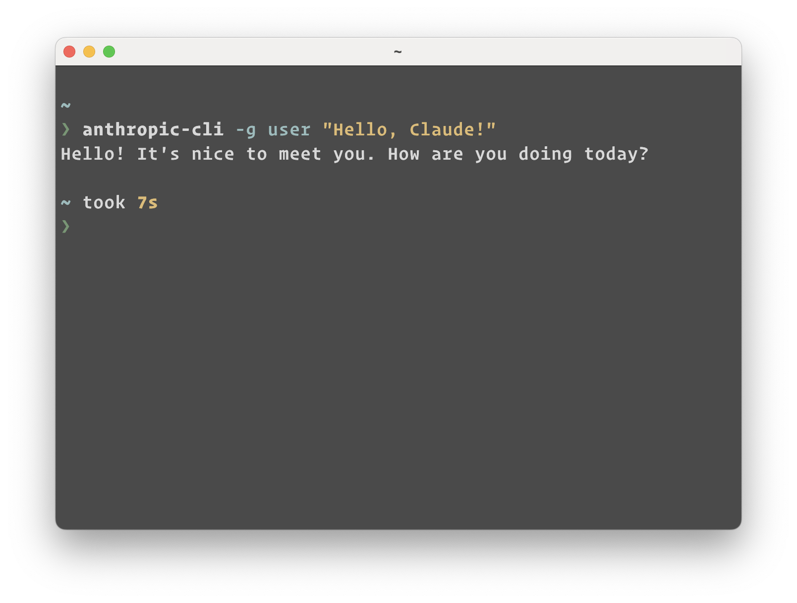

# Anthropic API Command Line Tool

This is a command line tool that allows you to interact with the Anthropic API using the Anthropic Python SDK. You can send messages, including text and images, to the API and receive responses.

**NOTE**: This CLI has been programmed by Claude 3



## Features

- Send text messages to the Anthropic API
- Include images (PNG, JPEG, or PDF) in the messages
- Specify various parameters such as model, system message, temperature, top-k, top-p, and max tokens
- Parse PDF files and convert into a JPEG image for processing (requires Poppler)

### Installing Poppler

Poppler is a separate library that is required by the `pdf2image` library for converting PDF files to images. The installation process for Poppler varies depending on your operating system.

Please check https://pdf2image.readthedocs.io/en/latest/installation.html for installation instructions.

You do not need to install Poppler if you don't plan on passing PDFs into the vision API.

## Setup

```
pip install anthropic-sdk
```

Set your Anthropic API key as an environment variable named `ANTHROPIC_API_KEY`. You can do this by running the following command in your terminal or adding it to your shell configuration file (e.g., `.bashrc`, `.zshrc`):

```bash
export ANTHROPIC_API_KEY="your_api_key_here"
```

Replace `"your_api_key_here"` with your actual Anthropic API key.

## Usage

To use the command line tool, run the following command:

```bash
python anthropic_cli.py [options]
```

### Options

- `-g`, `--message`: Add a message with the specified role and content. You can use this option multiple times to add multiple messages. The format is `-g <role> "<content>"`.
  - `<role>`: The role of the message sender, e.g., "user" or "assistant".
  - `<content>`: The content of the message, enclosed in double quotes.

- `-i`, `--image`: Path to an image file to include in the message. The image should be in PNG format.

- `-m`, `--model`: Anthropic model to use (default: "claude-3-opus-20240229").

- `-s`, `--system`: System message to provide context or instructions to the model.

- `-t`, `--temperature`: Temperature value for the model, controlling the randomness of the generated response.

- `-k`, `--top_k`: Top-k sampling parameter, restricting the model to consider only the top k most likely tokens.

- `-p`, `--top_p`: Top-p sampling parameter, restricting the model to consider only the most likely tokens whose cumulative probability exceeds p.

- `-x`, `--max_tokens`: Maximum number of tokens in the generated response (default: 1024).

### Examples

1. Send a simple message:

   ```bash
   python anthropic_cli.py -g user "Hello, Claude!"
   ```

2. Send multiple messages:

   ```bash
   python anthropic_cli.py -g user "Hello, Claude!" -g assistant "Hello! How can I assist you today?"
   ```

3. Include an image in the message:

   ```bash
   python anthropic_cli.py -g user "What does this image show?" -i path/to/image.png
   ```

4. Specify the model and other parameters:

   ```bash
   python anthropic_cli.py -g user "Hello, Claude!" -m claude-3-opus-20240229 -s "You are a helpful assistant." -t 0.8 -x 500
   ```

   This command uses the "claude-3-opus-20240229" model, sets a system message, adjusts the temperature to 0.8, and limits the maximum number of tokens in the response to 500.

## Output

The command line tool will send the messages and image (if provided) to the Anthropic API and print the text content of the response to the console.

## LICENSE

MIT